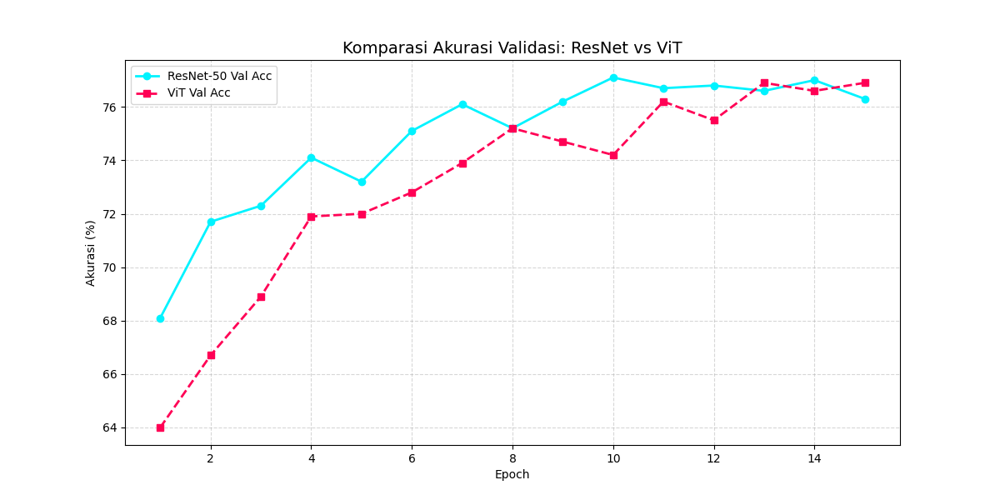
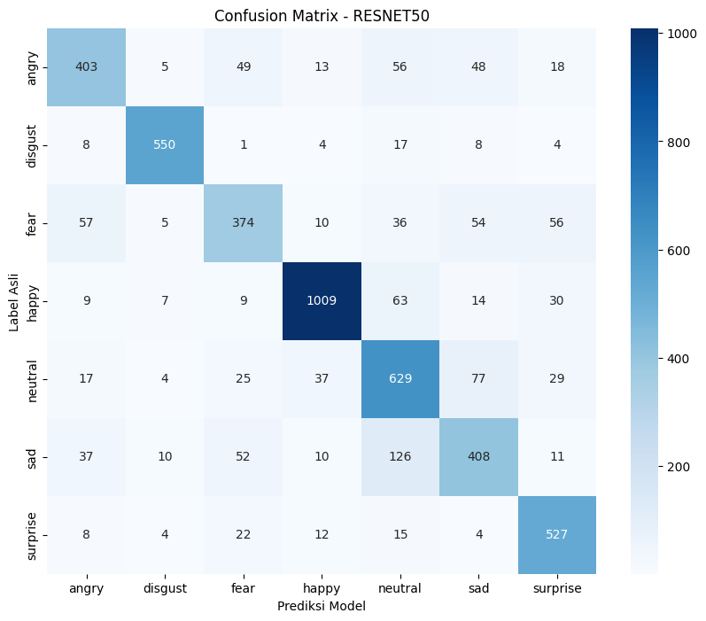

# Emotion Recognition Backup

Professional emotion recognition research repository with real-time webcam inference, model training, and evaluation reporting.

## Overview

This project implements an end-to-end facial emotion recognition system using PyTorch, MediaPipe, and Flask. It supports:
- training CNN and Transformer-based emotion classifiers,
- preprocessing and dataset splitting,
- real-time webcam inference with snapshot analysis,
- performance reporting through confusion matrices, training charts, and Grad-CAM explainability.

## Key Components

- `train.py` — training pipeline for emotion recognition models.
- `test_model.py` — evaluation script for test dataset performance.
- `split_data.py` — splits raw images into train/val/test sets.
- `web_app/app.py` — Flask-based real-time webcam interface.
- `src/model_defs.py` — model definitions for ResNet50 and ViT.
- `web_app/static/model_training_history.json` — training history used by report charts.
- `web_app/static/model_comparison_report.json` — model comparison metadata for the web UI.

## Project Structure

- `data/`
  - `raw/` — original dataset images organized by emotion class.
  - `processed/` — generated train/validation/test folders.
- `models/` — training checkpoints and history files.
- `web_app/`
  - `templates/` — Flask HTML templates.
  - `static/` — charts, report JSON, and CSS assets.
- `src/` — core model and utility definitions.
- `notebooks/` — analysis notebooks.
- `scripts/` — helper scripts for plotting and analysis.
- `backup_scripts/` — non-core scripts moved out of the main repository flow.

### Current folder tree

```
Emotion_Recognition_backup/
├── README.md
├── .gitignore
├── requirements.txt
├── train.py
├── test_model.py
├── split_data.py
├── src/
│   └── model_defs.py
├── web_app/
│   ├── app.py
│   ├── templates/
│   └── static/
├── data/
│   ├── raw/
│   └── processed/
├── models/
│   ├── baseline/
│   ├── resnet50/
│   ├── transformer/
│   └── vit/
├── notebooks/
├── scripts/
└── backup_scripts/
```

## Installation

Use Conda to isolate the environment and install dependencies.

```bash
conda create -n emotion_recog python=3.11 -y
conda activate emotion_recog
pip install -r requirements.txt
```

## Usage

### 1. Prepare the dataset

Place dataset folders under `data/raw/` with one directory per emotion label, for example:

```
data/raw/angry/
data/raw/happy/
data/raw/sad/
```

Then split the dataset:

```bash
python split_data.py
```

### 2. Train a model

```bash
python train.py
```

### 3. Evaluate the best model

```bash
python test_model.py
```

### 4. Run the real-time web app

```bash
python web_app/app.py
```

Then open the browser at `http://127.0.0.1:5000`.

## Reporting and Results

This repository includes generated visual outputs for analysis and reporting:

- `web_app/static/grafik_komparasi.png` — validation accuracy comparison graph.
- `web_app/static/confusion_matrix.png` — ResNet50 confusion matrix.
- `web_app/static/confusion_matrix_vit.png` — ViT confusion matrix.
- `web_app/static/gradcam_clean_resnet50.png` — Grad-CAM visualization on a clean face sample.

### Example outputs

#### Validation accuracy comparison



#### ResNet50 confusion matrix



#### Grad-CAM explainability


## Notes

- `data/` and `models/` are excluded from Git to avoid committing large datasets and checkpoints.
- `backup_scripts/` contains legacy or auxiliary scripts that are not required for core reproduction.
- Use the `web_app/static/model_training_history.json` file when updating report charts or adding new visualizations.

## Recommended Workflow

1. Activate Conda environment.
2. Split raw dataset with `split_data.py`.
3. Train with `train.py`.
4. Evaluate with `test_model.py`.
5. Start the web app with `web_app/app.py`.

## Push to GitHub

1. Periksa status kerja:

```bash
git status --short
```

2. Tambahkan file yang diperlukan:

```bash
git add README.md .gitignore web_app/static/model_comparison_report.json web_app/static/model_training_history.json
```

Jika sudah ada perubahan file lainnya yang ingin disimpan, tambahkan juga file tersebut.

3. Commit perubahan:

```bash
git commit -m "Prepare repository for GitHub: add README, update gitignore, include report assets"
```

4. Push ke remote utama:

```bash
git push origin main
```

Jika remote belum diset atau menggunakan nama branch lain, sesuaikan perintah dengan repo GitHub Anda.

## License

This project is configured for academic research and prototype development. Adjust license terms as required for publication or distribution.
